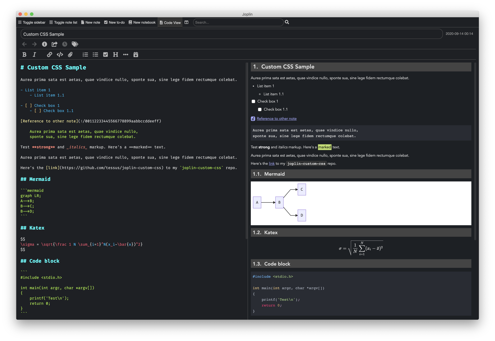

# K.C.'s custom styles for Joplin

Inspired by [Devon's repo](https://github.com/devonzuegel/joplin-custom-css) I've created my own style for Joplin. It's nothing fancy, but should work with all dark themes.
In the future I might add specific styles for other themes.

I've also added a [`sample.md`](sample.md) markdown file, which I used for testing the css.

## How to install

There are different ways you can install and use the theme.

### Theme Config Utility

- Clone the repository
- Run `./tcu`

See the [section](#tcu) below for a more detailed description of the utility.

### Manual Install

- Clone the repository into your Joplin profile directory. If you don't know where it is, go to `Preferences` and it will show you the location.
- Create symlinks to the `.css` files. (Remove or rename your current css files, if they already exist.)
- Create a new branch for your own changes. This will make it easier when new updates are available.

```
cd ~/.config/joplin-desktop
git clone https://github.com/tessus/joplin-custom-css.git
ln -s joplin-custom-css/Dark/userchrome.css
ln -s joplin-custom-css/Dark/userstyle.css
cd joplin-custom-css
git checkout -b my-css
# make changes to the css files and commit them
# when a new update is available, merge or rebase
git fetch origin master:master && git rebase master
```

## Dark



## tcu

Currently there's only one theme in the repository, so there's no need to specify it.

A backup of the css files will be created automatically in case data would be lost otherwise.

```
tcu - Theme Config Utility

usage: tcu [-t|--theme THEME] [-p|--profile PROFILE_DIR] [-x|--no-theme] [-c|--copy] [-d|--debug] [-V|--version] [-h] [--help]

       -t, --theme THEME
           activate THEME
           available themes:
              dark
              none (same as -x, --no-theme)

       -p, --profile PROFILE_DIR
           Joplin profile directory

       -x, --no-theme
           deactivate current theme

       -d, --debug
           print debug information

       -c, --copy
           copy files instead of creating symbolic links

       -V, --version
           version information

       -h
           usage information

       --help
           this help
```

## Credits

Many of the CSS snippets were taken from different topics on the [Joplin forum](https://discourse.joplinapp.org/). A few of them I used ad verbatim, others I had to adjust to match my theme, and others served as an inspiration.
