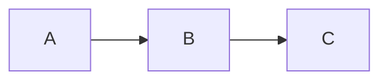

# Custom CSS Sample

Aurea prima sata est aetas, quae vindice nullo, sponte sua, sine lege fidem rectumque colebat.

- List item 1
	- List item 1.1

- [ ] Check box 1
	- [ ] Check box 1.1

[Reference to other note](:/00112233445566778899aabbccddeeff)

    Aurea prima sata est aetas, quae vindice nullo,
    sponte sua, sine lege fidem rectumque colebat.

Test **strong** and _italics_ markup. Here's a ==marked== text.

Aurea prima sata est aetas, quae vindice nullo, sponte sua, sine lege fidem rectumque colebat.

Here's the [link](https://github.com/tessus/joplin-custom-css) to my `joplin-custom-css` repo.

## Mermaid



## Katex

$$
\sigma = \sqrt{\frac 1 N \sum_{i=1}^N(x_i-\bar{x})^2}
$$

## Code block

```
#include <stdio.h>

int main(int argc, char *argv[])
{
    printf('Test\n');
    return 0;
}
```
